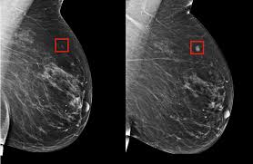
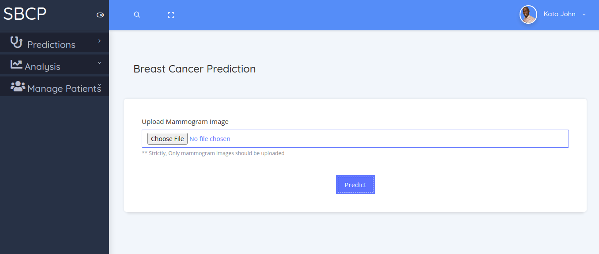

## Smart Breast Cancer Predictor System
### Abstract
Breast cancer in Uganda is the third commonest cancer in women, coming only next to cancer of the cervix and Kaposi's sarcoma. In this Project (SBCP), the Smart Breast Cancer Predictor Project members investigated how breast cancer is diagnosed in Uganda. The SBCP team members found out that the mammogram image is commonly used in diagnosis of breast cancer, the doctor spends more time (average of 18 minutes) to diagnose a single patient, and the number of breast cancer specialists is relatively small. Basing on the results of the study, we proposed to address the issues that we found out, by developing Smart Breast Cancer Predictor System to effectively predict breast cancer basing on mammogram images.
SBCP takes a mammogram image as its input, analyses it to find out whether there is presence of Breast Cancer. It provides graphical analysis of the rate of spread of breast cancer, keep track of patients’ breast cancer prediction results, and notifies patients whose results are predicted to be positive about the next checkup.
 The SBCP will mainly operate in health centers that handle issues related to breast cancer.
The requirements of the SBCP system are:
- R001 Smart Breast Cancer Predictor system shall allow Doctors to predict the presence of breast cancer.
- R002 Smart Breast Cancer Predictor system shall provide graphical analysis of the rate of spread of breast
  cancer.
- R003 Smart Breast Cancer Predictor system shall notify Patients diagnosed with breast cancer about the next
  checkup.

## How to use the SBCP Application

[Click Here to see the Online User Manual](https://laracasts.com). This will guide you on how to use the SBCP System 

## SBCP Developers

We would like to thank you for visiting our SBCP application  [SBCP Team](https://finalyearprojectforsaab.wordpress.com/roles).

- [Arnold Kalema](https://arnoldkk.000webhostapp.com/) 
[GIT REPO](https://github.com/kalemakk)

- [MUTUNGI DENNIS SHARP](https://arnoldkk.000webhostapp.com/) 
[GIT REPO](https://github.com/kalemakk)

- [NIYONSABA ALEX](https://arnoldkk.000webhostapp.com/) 
[GIT REPO](https://github.com/kalemakk)

- [OKOTH BRAIN](https://arnoldkk.000webhostapp.com/) 
[GIT REPO](https://github.com/kalemakk)

## Contributing

Thank you for considering contributing to the Laravel framework! The contribution guide can be found in the [Laravel documentation](https://laravel.com/docs/contributions).

## Code of Conduct

In order to ensure that the Laravel community is welcoming to all, please review and abide by the [Code of Conduct](https://laravel.com/docs/contributions#code-of-conduct).

## Security Vulnerabilities

If you discover a security vulnerability within Laravel, please send an e-mail to Taylor Otwell via [taylor@laravel.com](mailto:taylor@laravel.com). All security vulnerabilities will be promptly addressed.

## License

The Laravel framework is open-sourced software licensed under the [MIT license](https://opensource.org/licenses/MIT).
